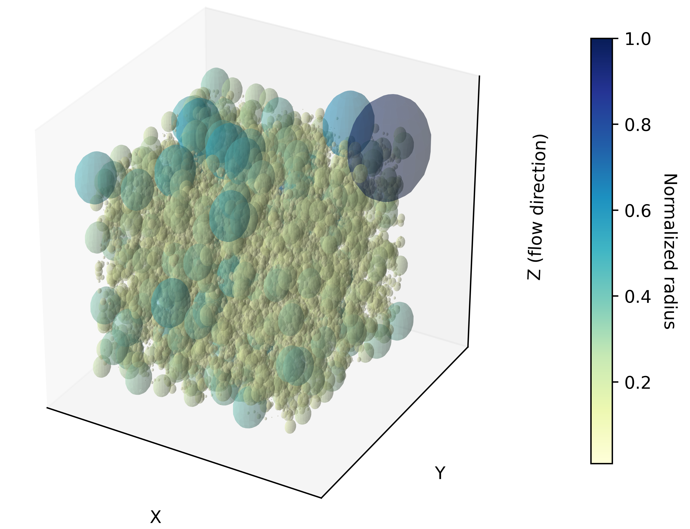

# VoidSizeAnalyzer
VoidSizeAnalyzer is a Python tool for quantifying and visualizing void size distributions in polymer systems. It uses a 3D probe insertion algorithm to map empty regions within a simulation box and determine their characteristic sizes.

Given particle coordinates (from random data or molecular simulation formats such as .gro), the code:

Discretizes the simulation box into a 3D grid.

Inserts a probe sphere at each grid center, expanding it until it contacts an existing particle.

Captures the maximum non-overlapping probe size at each location to build the void size distribution.

Renders the results as high-quality 3D visualizations for spatial analysis.

This enables the detailed study of polymer porosity, free volume, and nanostructure morphology, with direct visual insight into void connectivity and distribution.

